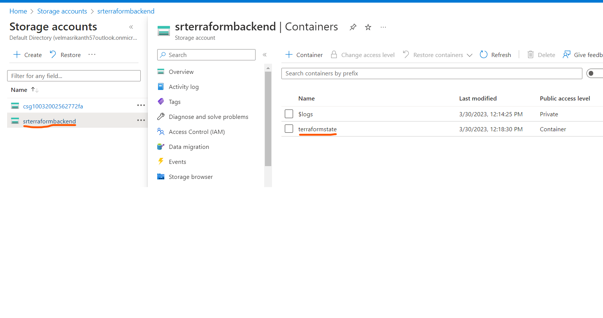
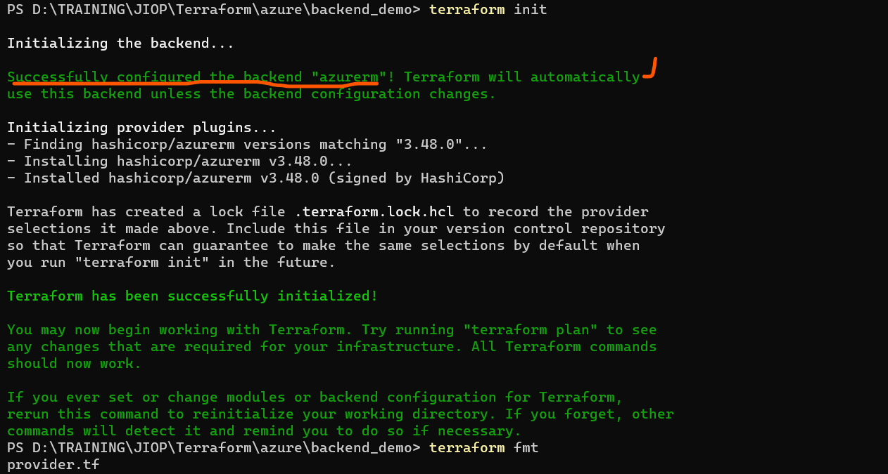
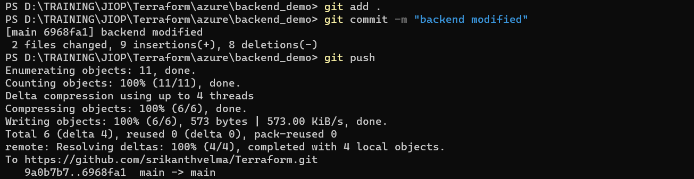
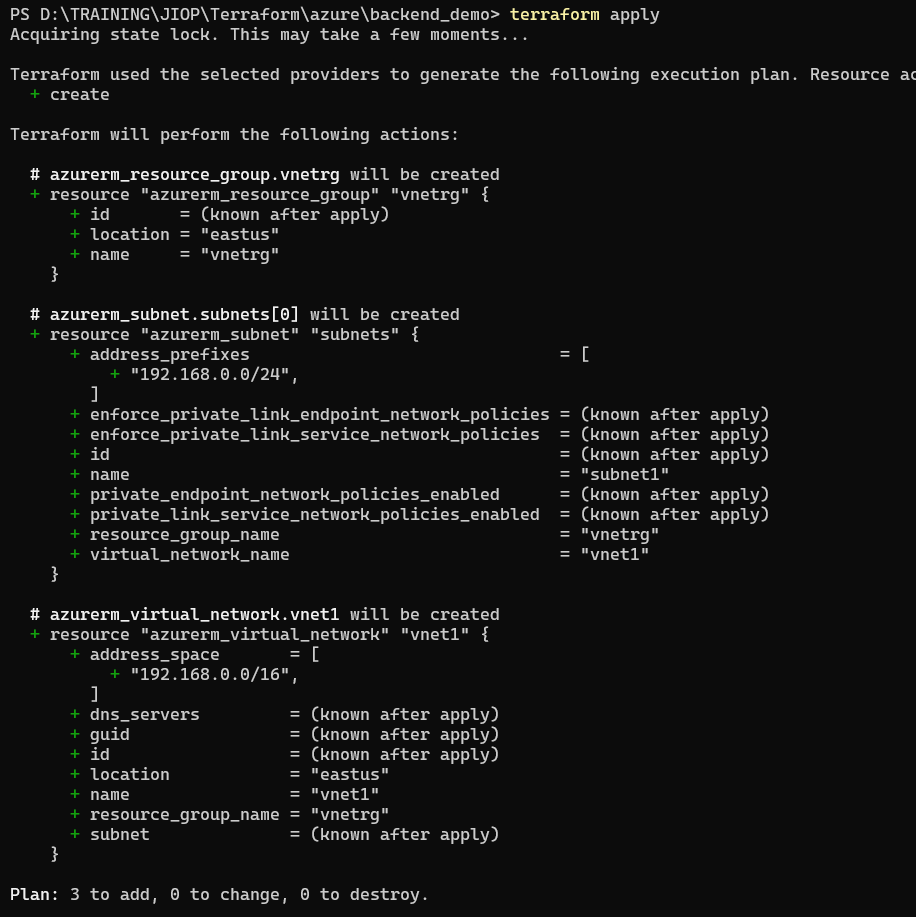
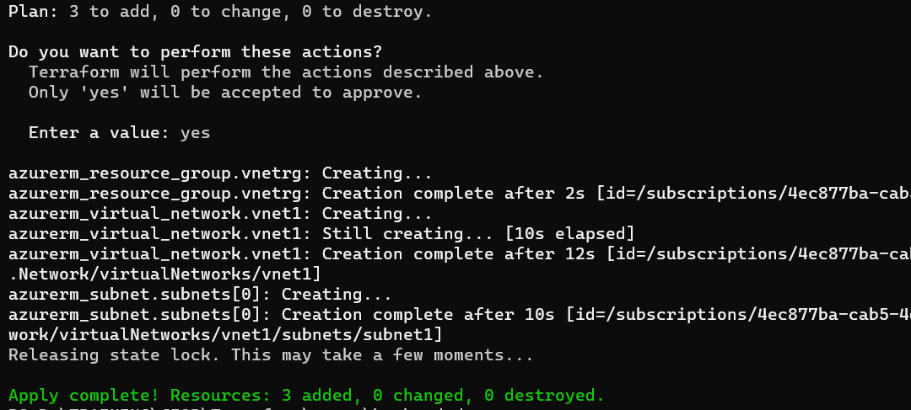
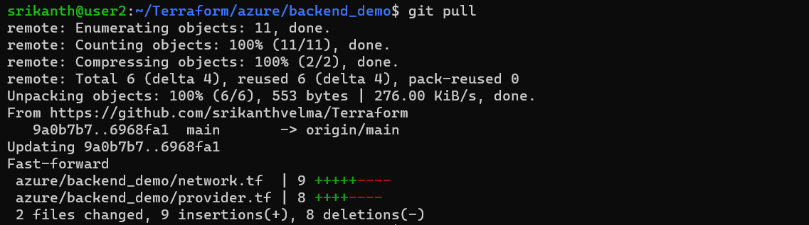
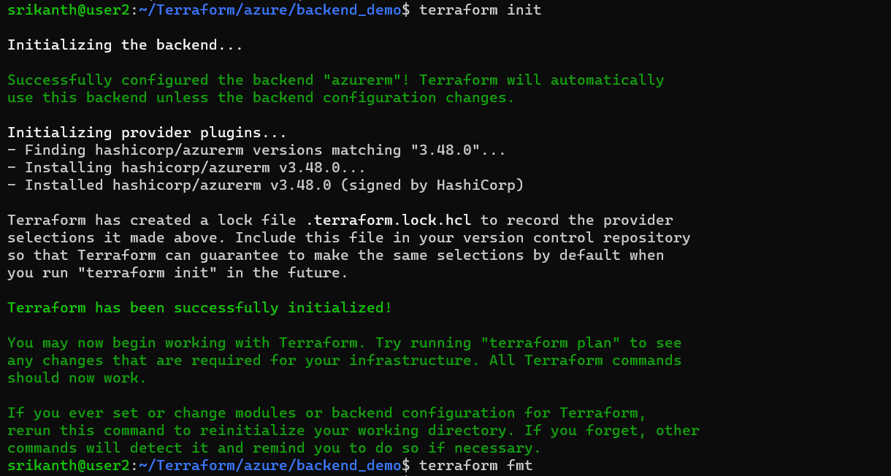
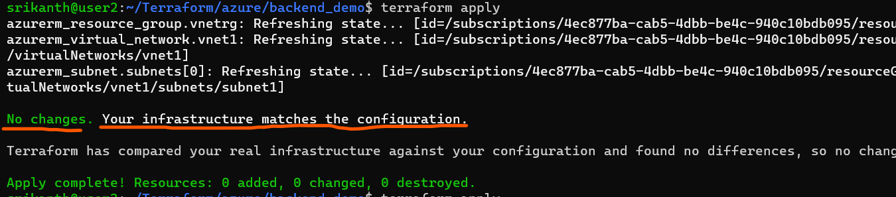

23-03-2023
----------
1. install terraform latest version (1.4.2) on windows
2. create azure/aws provider with 6 months older version
3. create user in azure/aws
4. definations for `provider`,`resource`,`argument`,`attribute`
* **provider**: where we have to create the resources
* **resource**: what we will create in the required encironment
* **argument**: inputs (parameters/functions) which are used to create resources
* **attribute**: output values from the terraform when we are creating resources

24-03-2023
----------
1. **Local Provider**: Create a file in any folder in your system (C:\temp\1.txt) with content Hello this is from terraform.
2. **Azure**/ **AWS**: Create a vnet with 6 subnets and explain the concept of count, Infra as Code
3. Shell Scripting video-1 to complete
4. **Count**: is a meta-argument defined by the Terraform language. It can be used with modules and with every resource type.The `count` meta-argument accepts a whole number, and creates that many instances of the resource or module. Each instance has a distinct infrastructure object associated with it, and each is separately created, updated, or destroyed when the configuration is applied.

25-03-2023
----------
1. . Create a network with 6 subnets with variables
        a. Variable should be of type object with fields for
            * i. Name
            * ii. CIDR ranges
            * iii. Subnet names
2. After creating using terraform apply try changing the CIDR range of subnets and VPC and reapply.
3. Explain the meaning of the following strings that seen at the beginning of each line when you run `terraform apply`
   * a. +
   * b. -
   * c. -/+
4. Shell Scripting: Day 2
5. Finish the Linux Refresher [refer][https://directdevops.blog/2023/02/15/linux-refresher/]

26-03-2023
-----------
1. Try generating random password from terraform and use it in database creation of Azure SQL Database or RDS instance
2. Write a template to create 2 vnets/vpcs and 6 subnets each by writing the vnet/vpc only once with count.
3. Azure:
    * a. Create a Resource group manually
    * b. Use a Datasource to get resource group details and create a network security group in that
4. AWS:
    * a. Create a Security group in default vpc.
    * b. Use Datasource to get default vpc
5. Try finishing core concepts and introduction to shell Become Efficient At Linux Command Line – Part 1 – Direct DevOps from Quality Thought
6. Shell Scripting video [refer][https://www.youtube.com/watch?v=u7ygLBX0olc&list=PLuVH8Jaq3mLtx82QrxoUre38AqJQwQ3bs&index=26]

30-03-2023
-----------
1. Demonstate terraform backend
-------------------------------
   * Generally terraform template can reusable and it can be used by multiple users also,so when multiple users are using same template (with same accounts or same credentials) in their local systems, so it will create the resourcs again .
   * Reason for above is , it stores different state files in their systems.
   * so to avoid this problems we use `Backend` 
   * Terraform Backend defines where it stores its state data files
   * Terraform uses a `terraform.state` file to know the status of resources it manages
   * Normally terraform uses `local` backend.
   * If multiple users want to access same template,we have to use `remote backend`
   * for this we should configure `remote backend` in backend block in terraform block in provider.tf
   * for remote backend - we config `storage account` in azure & `s3 bucket and dynamodb` in aws
   * after this if one user executes `terraform apply` , it will store the state file in remote
   * and then another execute terraform apply with same template , it reads the state file from remote and it doesnot create a any resources because as per state file infra already exits (note if second user doesnot change anything in template).
   * so ovarall backend is nothing but having a commonly stored terraform state file
### DEMO
1. Created Azure storage account 
 
2. Creating terraform template with backend config
* provider.tf
```t
terraform {
  required_providers {
    azurerm = {
      source  = "hashicorp/azurerm"
      version = "=3.48.0"
    }
  }
  backend "azurerm" {
    resource_group_name  = "terraformbackend"
    storage_account_name = "srterraformbackend"
    container_name       = "terraformstate"
    key                  = "test.terraform.tfstate"

  }
}
provider "azurerm" {
  features {}

}
```
* network.tf
```t
resource "azurerm_resource_group" "vnetrg" {
  name     = var.resource_group_name
  location = var.location
}
resource "azurerm_virtual_network" "vnet1" {
  name                = var.virtual_network_name
  resource_group_name = azurerm_resource_group.vnetrg.name
  location            = azurerm_resource_group.vnetrg.location
  address_space       = var.address_space

  depends_on = [
    azurerm_resource_group.vnetrg
  ]
}

resource "azurerm_subnet" "subnets" {
  count                = length(var.subnets)
  name                 = var.subnets[count.index]
  resource_group_name  = azurerm_resource_group.vnetrg.name
  virtual_network_name = azurerm_virtual_network.vnet1.name
  address_prefixes     = [cidrsubnet(var.address_space[0], 8, count.index)]

  depends_on = [
    azurerm_virtual_network.vnet1
  ]
}
```
* inputs.tf
```t
variable "resource_group_name" {
  type    = string
  default = "vnetrg"
}
variable "location" {
  type    = string
  default = "East US"
}
variable "virtual_network_name" {
  type    = string
  default = "vnet1"
}
variable "address_space" {
  type    = list(string)
  default = ["192.168.0.0/16"]
}
variable "subnets" {
  type    = list(string)
  default = ["subnet1"]
}
```
3. Executing terraform template in my local system

* now i ahve stored my template in git hub, so that i can use same template with other user




4. Now Executing with another user





### 2.call ARM template from terraform
