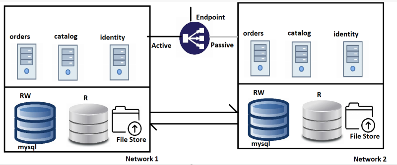

Terraform Course Notes
-----------------------
* Any organization needs Infrastructure to build and deploy the application into different environments (Dev,QA,UAT,Staging,Production).
* The Architecture required for a normal application 
  
* Infra required for above is
  * Two networks with connectivity b/w them (same building, different buildings, cities, countries)
  * in each network
    * 2 databases
      * mysql
      * RAM: 8 GB
      * cpus: 2
      * Disk: 10 TB
    * 1 file store
      * size :10TB
    * 3 servers
      * OS: UBUNTU 22.04
      * RAM : 16GB
      * Cpus: 2
      * Disk: 50GB
* To create this infra - we required InfraProvisioning tools
* **InfraProvisioning**: This represents using Infrastructure as a Code and deploy to target environment
* We use InfraProvisioing tools where we express our desired state about infrastructure as code.
### Understanding InfraProvisoning


* **Terraform**: Can create infra in almost all the virtual environments using IaC(Infrastructure as code).
* ARM Templates: Can create infra in Azure
* Cloudformation: Can create infra in AWS
* Infraprovisiong tools use IaC which are generally idempotent
* **Idempotance** is the property which states execution one time or multiple times leads to the same result.
* Reusability is extreemely simple and terraform can also handle multiple environments (Developer, QA, UAT/Staging/Production).

## Terraform
* Terraform is an opensource tool developed by HashiCorp which can create infra in almost any virtual platform
* Terraform uses a language which is called as Hashicorp Configuration Language (HCL) to express desired State.
### Terms
* Resource: This is the infrastructure which you want to create
* Provider: This refers to where you want to create infrastructure
* arguments: The inputs which we express in teraform are called as arguments
* attribute: The output given by terraform is referred as attribute
### Installing Terraform
* [referhere](https://developer.hashicorp.com/terraform/downloads)


### Azure Provider
* To install azure cli [refer](https://learn.microsoft.com/en-us/cli/azure/)
* After installing cli ,we have to config cli where ever we need it, for terraform i have configured in my system and also we have know the process for linux m/c
* To config azure cli `az login` => it will redirect to microsoft web page then we have select our azure account id, then it will configured automatically
* To check authentication done or not we can check by command `az group list` which will show the resource groups list
* for terraform to work with ,we need to config provider first
* Azure provider [refer](https://registry.terraform.io/providers/hashicorp/azurerm/latest/docs)
* Azure provider syntax
```t
# if we required particular version of provider below terraform block is req
terraform {
required_providers {
  azurerm = {
    source  = "hashicorp/azurerm"
    version = "=3.0.0"
    }
  }
}

# normally if we start with below provider blcok directly
provider "azurerm" {
  feature {}
}
```
* Azure Resource syntax
```t
resource "type of resource" "resource name" {    # type of resource could be provide_resourcetype
  arg 1 = val 1
  arg 2 = val 2
}

# create a resource group
resource "azurerm_resource_group" "workshop" {
  name = "workshop"
  location = "East US"
}

```
### VPC Creation in AWS through terraform
* Manual inputs for vpc creation
* `Name tag : "ntiervpc"`
* `cidr_block : "192.168.0.0/24`
* Lets create it from terraform
* first create terraform template `main.tf` in specific folder ex: /aws/vpc
```t
provider "aws" {
  region = "ap-south-1"

}

resource "aws_vpc" "app" {
  cidr_block = "192.168.0.0/16"

  tags = {
    "Name" = "app1"
  }

}
```
* `terraform init`    # to config terraform and provider


* `terraform validate`  # to validate the syntax

* `terraform apply`     # to run template tasks (creating, modifying)


* `terraform destroy`  # to delete the created resources from terraform


### Creation of vnet in azure through terraform
* Manual requirements
  * resource group
    * `name = "vnetgroup"`
    * `location = "East US"`
  * vnet
    * `name = "vnet1"`
    * `resource_group_name = "vnetgroup"`
    * `location = "East US"`
    * `address_space = ["192.168.0.0/16"]`
  * subnet
    * `name = "appsubnet1"`
    * `address_prefix = "192.168.0.0/24"`
* lets create a vnet from terraform template
``` t
provider "azurerm" {
  features {}

}

resource "azurerm_resource_group" "vnet" {
  name     = "vnetgroup"
  location = "East US"

}

resource "azurerm_virtual_network" "vnet1" {
  name                = "vnet1"
  resource_group_name = "vnetgroup"
  location            = "East US"
  address_space       = ["192.168.0.0/16"]

  subnet {
    address_prefix = "192.168.1.0/24"
    name           = "appsubnet"
  }
  
  depends_on = [                  # depends_on Meta argument in terraform ,used for dependecy of task
    azurerm_resource_group.vnet
  ]
}
```
```t
terraform init
terraform fmt
terraform validate
terraform apply -auto-approve
terraform destroy
```


* To Work effectively with terrform templates we need to understand Hashicorp Configuration Language
### Hashicorp Configuration Language (HCL) for Terraform
* For specification [referhere](https://github.com/hashicorp/hcl/blob/main/hclsyntax/spec.md)
* For **Providers** of Terraform [refer](https://developer.hashicorp.com/terraform/language/providers)
* The terraform block helps in configuring the provider with version of the provider from registry [refer](https://developer.hashicorp.com/terraform/language/settings)
* syntax
```t
terraform {
  required_providers {
    aws = {
      version = ">= 2.7.0"
      source = "hashicorp/aws"
    }
  }
}

```
* Specify which version of terraform you should be using use required_version. To specify constraints[refer](https://developer.hashicorp.com/terraform/language/expressions/version-constraints)
```t
terraform {
  required_version = ">= 1.0.0"
  required_providers {
    aws = {
        source = "hashicorp/aws"
        version = ">= 4.47.0"
    }
  }
}


provider "aws" {

}
resource "aws_vpc" "ntier" {
    cidr_block = "192.168.0.0/16"
    tags = {
        Name = "ntier"
    }
  
}
```
* This low-level syntax of the Terraform language is defined in terms of a syntax called HCL, which is also used by configuration languages in other applications, and in particular other HashiCorp products.
* The Terraform language syntax is built around two key syntax constructs: arguments and blocks.
#### Arguments
* An argument assigns a value to a particular name:
* The identifier before the equals sign is the argument name, and the expression after the equals sign is the argument's value.
```t
image_id = "abc123"
```
#### Blocks
* A block is a container for other content:
* A block has a type (resource in this example). Each block type defines how many labels must follow the type keyword. The resource block type expects two labels, which are aws_instance and example in the example above. A particular block type may have any number of required labels, or it may require none as with the nested network_interface block type.
* After the block type keyword and any labels, the block body is delimited by the { and } characters. Within the block body, further arguments and blocks may be nested, creating a hierarchy of blocks and their associated arguments.
```t
resource "aws_instance" "example" {
  ami = "abc123"

  network_interface {
    # ...
  }
}
```
#### Identifiers
* Argument names, block type names, and the names of most Terraform-specific constructs like resources, input variables, etc. are all identifiers.
* Identifiers can contain letters, digits, underscores (_), and hyphens (-). The first character of an identifier must not be a digit, to avoid ambiguity with literal numbers.
#### Comments
* The Terraform language supports three different syntaxes for comments:
  * `#` begins a single-line comment, ending at the end of the line.
  * `//` also begins a single-line comment, as an alternative to `#`.
  * `/*` and `*/` are start and end delimiters for a comment that might span over multiple lines.
### Parametrizing Terraform
#### Input Variables
* [referhere](https://developer.hashicorp.com/terraform/language/values/variables)
* For inputs terraform supports the following types
    * number
    * string
    * boolean
    * list()
    * set()
    * map()
    * object({ = , … })
    * tuple([, …])
* Input variables are like function arguments.
* Each input variable accepted by a module must be declared using a variable block: 
```t
variable "image_id" {
  type = string
}

variable "availability_zone_names" {
  type    = list(string)
  default = ["us-west-1a"]
}

variable "docker_ports" {
  type = list(object({
    internal = number
    external = number
    protocol = string
  }))
  default = [
    {
      internal = 8300
      external = 8300
      protocol = "tcp"
    }
  ]
}
```
* The label after the `variable` keyword is a name for the variable, which must be unique among all variables in the same module. This name is used to assign a value to the variable from outside and to reference the variable's value from within the module.
* The name of a variable can be any valid identifier except the following: `source`, `version`, `providers`, `count`, `for_each`, `lifecycle`, `depends_on`, `locals`.
* These names are reserved for meta-arguments in module configuration blocks, and cannot be declared as variable names.
#### Arguments
* Terraform CLI defines the following optional arguments for variable declarations:

* `default` - A default value which then makes the variable optional.
* `type` - This argument specifies what value types are accepted for the variable.
* `description` - This specifies the input variable's documentation.
* `validation` - A block to define validation rules, usually in addition to type constraints.
* `sensitive` - Limits Terraform UI output when the variable is used in configuration.
* `nullable` - Specify if the variable can be null within the module.
#### Using Input Variable Values
* Within the module that declared a variable, its value can be accessed from within expressions as `var.<NAME>`, where `<NAME>` matches the label given in the declaration block:
* **Note**: Input variables are created by a `variable` block, but you reference them as attributes on an object named `var`.
```t
resource "aws_instance" "example" {
  instance_type = "t2.micro"
  ami           = var.image_id
}
```
#### Assigning Values to Root Module Variables
* When variables are declared in the root module of your configuration, they can be set in a number of ways:
  * Individually, with the `-var` command line option.
  * In variable definitions `(.tfvars)` files, either specified on the command line or automatically loaded.
  * As environment variables.
* `terraform apply -var "region=ap-south-2" -var "ntier-vpc-range=10.10.0.0/16"`
* `terraform apply -var-file values.tfvars`
* Terraform also automatically loads a number of variable definitions files if they are present:
Files named exactly `terraform.tfvars` or `terraform.tfvars.json`.
Any files with names ending in `.auto.tfvars` or `.auto.tfvars.json`.
### JOIP task - 24-03-2023
* **Count**: is a meta-argument defined by the Terraform language. It can be used with modules and with every resource type.The `count` meta-argument accepts a whole number, and creates that many instances of the resource or module. Each instance has a distinct infrastructure object associated with it, and each is separately created, updated, or destroyed when the configuration is applied.
* Ex: `count = length(var.subnets)`
* **length**:
* 
* create a vnet with 6 subnets
* for above task done by using `variables`,`count`,`cidrsubnet`,`values.tfvars file`
* provider.tf
```t
terraform {
  required_providers {
    azurerm = {
      source  = "hashicorp/azurerm"
      version = "=3.48.0"
    }
  }
}

provider "azurerm" {
  features {}

}
```
* main.tf 
```t
resource "azurerm_resource_group" "vnetrg" {
  name     = var.resource_group_name
  location = var.location

}

resource "azurerm_virtual_network" "vnet1" {
  name                = var.virtual_network_name
  resource_group_name = azurerm_resource_group.vnetrg.name
  location            = azurerm_resource_group.vnetrg.location
  address_space       = var.address_space

  depends_on = [
    azurerm_resource_group.vnetrg
  ]
}

resource "azurerm_subnet" "subnets" {
  count                = length(var.subnets)
  name                 = var.subnets[count.index]
  resource_group_name  = azurerm_resource_group.vnetrg.name
  virtual_network_name = azurerm_virtual_network.vnet1.name
  address_prefixes     = [cidrsubnet(var.address_space[0], 8, count.index)]

  depends_on = [
    azurerm_virtual_network.vnet1
  ]
}
```
* inputs.tf (variables file)
```t
variable "resource_group_name" {
  type    = string
  default = "vnetrg"
}
variable "location" {
  type    = string
  default = "East US"
}
variable "virtual_network_name" {
  type    = string
  default = "vnet1"
}
variable "address_space" {
  type    = list(string)
  default = ["192.168.0.0/16"]
}
variable "subnets" {
  type    = list(string)
  default = ["subnet1", "subnet2", "subnet3", "subnet4", "subnet5", "subnet6"]

}
```
* values.tfvars
```t
resource_group_name = "vnetgroup"
location = "Central India"
virtual_network_name = "vnet2"
address_space = [ "10.0.0.0/16" ]
subnets = [ "app1","app2","app3","db1","db2","db3" ]
```
* without using values.tfvars


* with using values.tfvars file
* `terraform apply -var-file values.tfvars`
* 
#### Creating vnet with `objects in variables`
* main.tf
```t
resource "azurerm_resource_group" "vnetrg" {
  name     = var.resource_group_info.rg_name
  location = var.resource_group_info.location

}

resource "azurerm_virtual_network" "vnet1" {
  name                = var.virtual_network_info.vnet_name
  resource_group_name = azurerm_resource_group.vnetrg.name
  location            = azurerm_resource_group.vnetrg.location
  address_space       = var.virtual_network_info.address_space

  depends_on = [
    azurerm_resource_group.vnetrg
  ]
}

resource "azurerm_subnet" "subnets" {
  count                = length(var.virtual_network_info.subnet_names)
  name                 = var.virtual_network_info.subnet_names[count.index]
  resource_group_name  = azurerm_resource_group.vnetrg.name
  virtual_network_name = azurerm_virtual_network.vnet1.name
  address_prefixes     = [cidrsubnet(var.virtual_network_info.address_space[0], 8, count.index)]

  depends_on = [
    azurerm_virtual_network.vnet1
  ]
}
```
* inputs.tf
```t
variable "resource_group_info" {
  type = object({
    rg_name  = string
    location = string
  })
  default = {
    location = "East US"
    rg_name  = "vnetrg"
  }

}

variable "virtual_network_info" {
  type = object({
    vnet_name     = string
    address_space = list(string)
    subnet_names  = list(string)
  })
  default = {
    vnet_name     = "vnet1"
    address_space = ["192.168.0.0/16"]
    subnet_names  = ["subnet1", "subnet2", "subnet3", "subnet4", "subnet5", "subnet6"]
  }
}
```
* with values.tfvars file
* values.tfvars
```t
resource_group_info = {
  location = "Central India"
  rg_name  = "vnetgroup"
}
virtual_network_info = {
  address_space = ["10.0.0.0/16"]
  subnet_names  = ["app1", "app2", "app3", "db1", "db2", "db3"]
  vnet_name     = "vnet2"
}
```

## Ntier Architecture Creation from Terraform
* **Azure Ntier**
* First now Creating Ntier network with 4 subnets `app1,app2,db1,db2` without using variables
```t
resource "azurerm_resource_group" "ntierrg" {
  name     = "ntierrg"
  location = "East US"
}

resource "azurerm_virtual_network" "ntiervnet" {
  name                = "ntiervnet"
  resource_group_name = "ntierrg"
  location            = "East US"
  address_space       = ["192.168.0.0/16"]

  subnet {
    name           = "app1"
    address_prefix = "192.168.0.0/24"
  }

  subnet {
    name           = "app2"
    address_prefix = "192.168.1.0/24"
  }

  subnet {
    name           = "db1"
    address_prefix = "192.168.2.0/24"
  }

  subnet {
    name           = "db2"
    address_prefix = "192.168.3.0/24"
  }
  depends_on = [
    azurerm_resource_group.ntierrg
  ]
}
```


#### Ntier : 
  1. VNet
  2. Subnet
  3. Security group
  4. Security rule
  5.  

